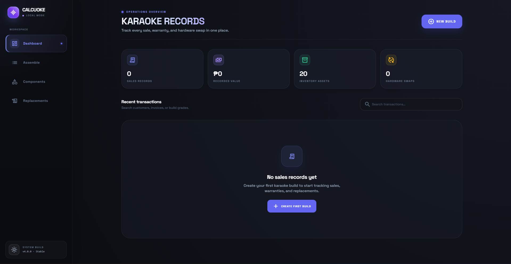
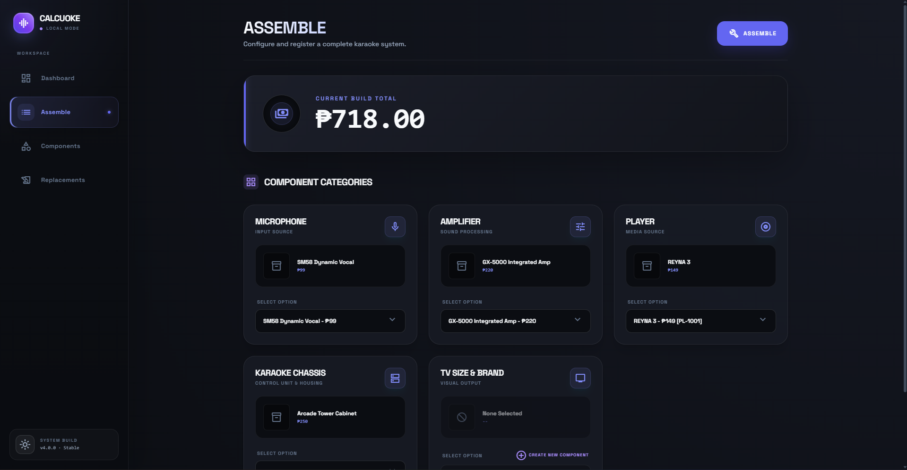
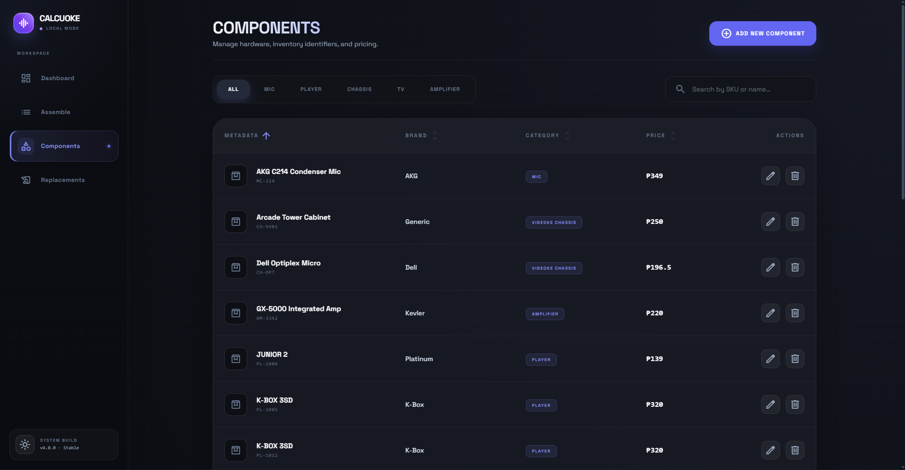
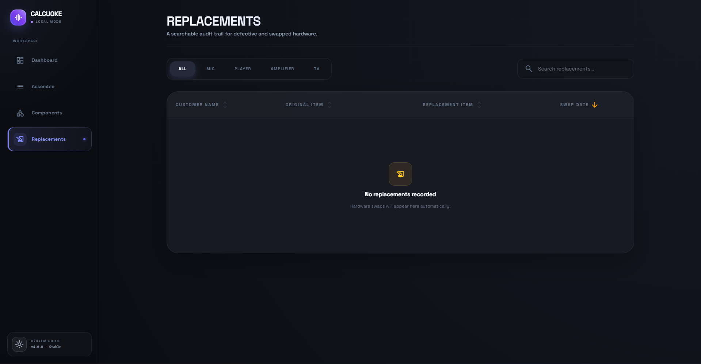
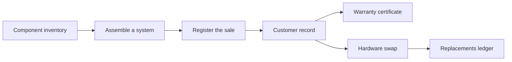
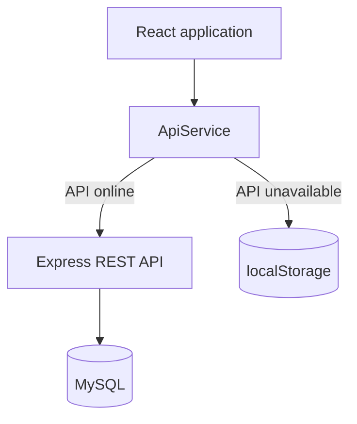

<div align="center">
  <h1>Calcuoke</h1>
  <h2>Built With</h2>
  <p>
    
    
    
    
    <br />
    
    
    
  </p>
</div>

---

## Why Calcuoke?

Karaoke system sales involve more than adding up components. Teams need to know which serialized player went to which customer, what was originally covered by warranty, and whether a replacement is still eligible. Calcuoke keeps that operational history connected from assembly through after-sales support.

- **Build with confidence** — configure a complete system from categorized inventory with a live total.
- **Keep every sale traceable** — retain customer, receipt, date, component, serial number, and photo records.
- **Support customers faster** — validate swap eligibility and choose same-model or alternative hardware.
- **Generate professional paperwork** — preview, print, or download warranty certificates as PDF.
- **Work with or without MySQL** — use the Express API in connected mode or automatic browser storage fallback in simulation mode.

## Preview

<table>
  <tr>
    <td align="center" valign="top" width="50%">
      
      <br />
      <strong>Sales dashboard</strong>
    </td>
    <td align="center" valign="top" width="50%">
      
      <br />
      <strong>System assembly</strong>
    </td>
  </tr>
  <tr>
    <td align="center" valign="top" width="50%">
      
      <br />
      <strong>Component inventory</strong>
    </td>
    <td align="center" valign="top" width="50%">
      
      <br />
      <strong>Replacements ledger</strong>
    </td>
  </tr>
</table>

The interface includes responsive desktop and mobile navigation, accessible light and dark themes, searchable records, polished empty states, and workflow-focused dialogs.

## Features

### Operations dashboard

- Summary cards for sales records, recorded value, inventory assets, and hardware swaps.
- Search by customer, invoice number, or build grade.
- Detailed customer records with photos, bill of materials, sale totals, and warranty access.

### Karaoke system assembly

- Dedicated selectors for microphone, amplifier, player, chassis, and TV.
- Live build total and automatic Standard or Premium grading.
- Contextual component creation when a required category has no inventory.
- Sale registration with customer details, receipt type, date, address, and compressed photos.

### Inventory management

- Create, edit, search, sort, filter, and remove component records.
- SKU and serial uniqueness checks with categorized hardware metadata.
- Image upload and preview support.
- Inventory-aware player selection and deduction after a completed sale.

### Warranty and replacements

- Warranty certificate preview with print and PDF export.
- Original purchase components remain preserved after later swaps.
- Same-model, alternative-model, and newly registered replacement flows.
- Centralized replacement ledger with customer, hardware, serial number, category, and date details.

### Experience and resilience

- Modern commerce-inspired light and dark themes.
- Responsive layouts for desktop, tablet, and mobile screens.
- Toast feedback for successful and failed operations.
- Automatic local simulation mode when the API is unavailable.

## Application flow



The client accesses data through one service layer. If the Express API responds, records are persisted in MySQL. If it does not, the same workflows continue in browser storage.



## Quick start

Simulation mode is the fastest way to explore Calcuoke. It does not require MySQL.

### Prerequisites

- [Node.js](https://nodejs.org/) 20 LTS recommended
- npm

### Install and run

```bash
git clone https://github.com/jrpbone/Calcuoke.git
cd Calcuoke
npm install
npm run client
```

Open [http://localhost:5173](http://localhost:5173). When the API is unavailable, Calcuoke displays **Local mode** and initializes sample components in `localStorage`.

> Browser data is local to the current origin and browser profile. Clearing site data removes simulation records.

## Full-stack setup

Use connected mode when records should persist in MySQL and be shared through the REST API.

### 1. Create the database

The included schema creates the `calcuoke` database and its component, project, photo, and swap tables.

```bash
mysql -u root -p -e "source database/schema.sql"
```

> `database/schema.sql` drops and recreates Calcuoke tables. Use it for local setup, not against a production database containing records.

### 2. Configure the API

The server reads the following environment variables and otherwise uses local-development defaults:

| Variable      | Default     | Purpose          |
| ------------- | ----------- | ---------------- |
| `DB_HOST`     | `localhost` | MySQL hostname   |
| `DB_PORT`     | `3306`      | MySQL port       |
| `DB_USER`     | `root`      | MySQL user       |
| `DB_PASSWORD` |             | MySQL password   |
| `DB_NAME`     | `calcuoke`  | Database name    |
| `PORT`        | `3001`      | Express API port |

PowerShell example:

```powershell
$env:DB_USER="root"
$env:DB_PASSWORD="your-password"
npm run dev
```

macOS or Linux example:

```bash
DB_USER=root DB_PASSWORD=your-password npm run dev
```

`npm run dev` starts both services:

| Service      | URL                                                                  |
| ------------ | -------------------------------------------------------------------- |
| React client | [http://localhost:5173](http://localhost:5173)                       |
| Express API  | [http://localhost:3001/api](http://localhost:3001/api)               |
| Health check | [http://localhost:3001/api/status](http://localhost:3001/api/status) |

## Available commands

| Command           | Description                              |
| ----------------- | ---------------------------------------- |
| `npm run client`  | Start the Vite client development server |
| `npm run server`  | Start the Express API with Nodemon       |
| `npm run dev`     | Run the client and API together          |
| `npm run build`   | Type-check and create a production build |
| `npm run preview` | Preview the production build locally     |

## Tech stack

| Layer            | Technology                                           |
| ---------------- | ---------------------------------------------------- |
| Interface        | React 19, TypeScript, Tailwind utilities, custom CSS |
| Tooling          | Vite 6, npm                                          |
| API              | Express 4, CORS                                      |
| Database         | MySQL with`mysql2` connection pooling                |
| Documents        | html2pdf.js                                          |
| Icons and type   | Material Symbols, Space Grotesk                      |
| Offline fallback | Browser`localStorage`                                |

## Project structure

```text
Calcuoke/
|-- backend/                 # Express and MySQL REST API
|-- components/              # Shared and feature-level UI
|   |-- assemble/            # Assembly and sale dialogs
|   `-- dashboard/           # Records, swaps, and warranty UI
|-- data/                    # Domain types and sample inventory
|-- database/                # Local MySQL schema
|-- hooks/                   # Data, notifications, and theme state
|-- image/README/            # GitHub showcase images
|-- lib/                     # API/local simulation service
|-- pages/                   # Main application screens
|-- App.tsx                  # Application shell and view orchestration
|-- index.css                # Shared responsive theme system
|-- index.html               # Browser shell and external UI resources
`-- vite.config.ts           # Vite development configuration
```

## Business rules at a glance

- Builds above `₱75,000` are labeled **Premium Setup**; other builds are **Standard Commercial**.
- Player hardware can be swapped throughout its supported service flow.
- Non-player eligible categories use the configured seven-day swap window.
- Chassis components cannot be swapped and do not receive warranty coverage.
- Warranty documents retain the originally purchased bill of materials even after replacements.
- Receipt identifiers use their selected prefix; paper records use `PAPER-VOID`.

## Contributing

Contributions are welcome. Read [CONTRIBUTING.md](CONTRIBUTING.md) before opening a pull request. The requested [CONTRIBUTIONS.md](CONTRIBUTIONS.md) filename is also available as a compatibility link.

For release history, see [CHANGELOG.md](CHANGELOG.md).

## License

Calcuoke is distributed under the [GNU General Public License v3.0](LICENSE). If you distribute a modified version, the GPL requires the corresponding source and license terms to remain available.

---

<div align="center">
  Built for clearer karaoke sales, inventory, and after-sales operations.
</div>
